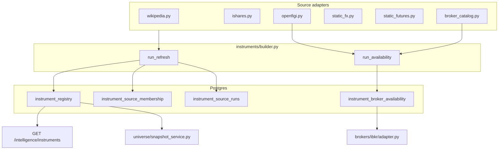
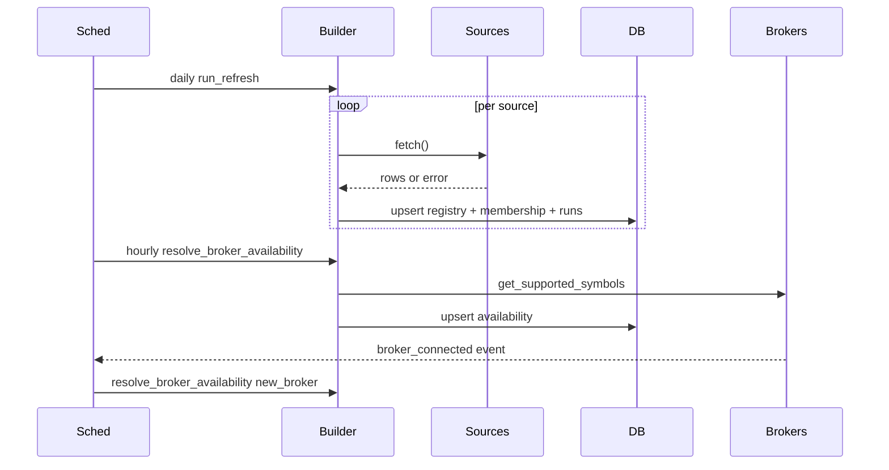

# Instrument Registry + Cross-Broker Availability Resolver (D116)

Self-updating instrument master that replaces hand-maintained per-broker
symbol lists with constituents from public maintained sources, resolves
per-broker availability for every connected broker, refreshes on a
schedule, and re-evaluates whenever a new broker connects.

The registry is **strictly observational**:

- Does **not** touch `brokers/base.py`, `risk/engine.py`,
  `execution/engine.py`, `signals/*`, `strategies/*`, `portfolio/*`.
- Does **not** place orders, score signals, or constrain risk.
- It is consumed by `brokers/ibkr/adapter.py::get_supported_symbols()`
  (behind a feature flag) and by the dashboard's Universe Intelligence
  panel.

The risk engine's unconditional veto power is preserved. IBKR
`place_order()` still calls `qualifyContractsAsync` before any order is
submitted.

---

## Architecture



---

## Data model

Postgres tables (Alembic migration
`alembic/versions/d116a1b2c3d4_instrument_registry.py`):

| Table | Purpose |
| --- | --- |
| `instrument_registry` | Canonical master. PK: `canonical_symbol`. Holds asset class, region, exchange, currency, sector/industry, ISIN, FIGI, first/last/refreshed seen timestamps, `retired_at`, free-form JSON `metadata`. |
| `instrument_source_membership` | One row per `(canonical_symbol, source_id)`. Tracks `source_version`, `external_id`, `last_seen_at`, `consecutive_miss_count`, metadata. |
| `instrument_broker_availability` | One row per `(canonical_symbol, broker)`. Status enum: `unknown`, `available`, `unavailable`, `requires_qualification`, `blocked`. Holds `broker_symbol`, last-checked / last-available timestamps, IBKR qualification payload, error string. |
| `instrument_source_runs` | Audit log of every refresh. `id PK`, `source_id`, started/finished timestamps, status enum (`success`, `partial`, `failed`), counters, notes, error. |

Retirement policy: a symbol is marked `retired_at` only after
`consecutive_miss_count >= min_consecutive_misses` (default 5) across at
least `min_sources_missing` independent sources (default 2). **No
symbol is ever hard-deleted.**

---

## Canonical symbol form

The canonical form is yfinance-compatible. Examples:

| Asset | Canonical | Example broker form |
| --- | --- | --- |
| US equity | `AAPL` | IBKR `AAPL`, Alpaca `AAPL` |
| UK equity | `HSBA.L` | IBKR `HSBA` on LSE / USD currency |
| German equity | `SAP.DE` | IBKR `SAP` on IBIS / EUR currency |
| Japanese equity | `7203.T` | IBKR `7203` on TSEJ / JPY |
| Hong Kong | `0700.HK` | IBKR `700` on SEHK / HKD |
| Crypto | `BTC-USD` | Kraken `XBT/USD`, Binance `BTCUSDT`, IBKR `BTC` |
| FX | `EURUSD=X` | IBKR `EUR.USD` |
| Future | `ES=F` | IBKR `ES` on CME |

The module `instruments/canonical.py` exposes:

- `to_canonical(raw, *, broker=None, asset_class_hint=None,
  region_hint=None) -> CanonicalSymbol | None`
- `canonical_to_broker(canonical, broker, *, asset_class=None) -> str | None`
- `from_broker_symbol(raw, broker, *, asset_class=None) -> CanonicalSymbol | None`
- `detect_asset_class(raw) -> AssetClassHint | None`

`data/universe_builder.py::_to_yf_symbol` is a thin wrapper over
`to_canonical(...)` for backward compatibility.

---

## Source adapters

All adapters live in `instruments/sources/` and conform to the
`Source` protocol defined in `instruments/sources/base.py`. Every
adapter is fault-isolated; one failure cannot taint other sources.

| Adapter | What it does |
| --- | --- |
| `http.py` | Polite shared HTTP client (User-Agent `mytbot/instrument-registry`, per-host rate limit, ETag/Last-Modified caching, retry with jitter, timeouts). |
| `wikipedia.py` | Parses ~20 index pages via `pandas.read_html`: S&P 500/400/600, Nasdaq-100, Dow 30, FTSE 100/250, DAX/MDAX/SDAX, CAC 40, Euro Stoxx 50, Nikkei 225, TOPIX Core 30, Hang Seng, ASX 200, TSX 60, MSCI overlays. Requires `lxml`. |
| `ishares.py` | Fetches CSV holdings for ~40 funds (IVV, IJH, IJR, IWB, IWM, IWV, ISF, MIDD, EXX1, EWJ, EWG, EWU, EWQ, EWC, EWA, EWY, MCHI, FXI, EEM, VWO, EZU, SPDR sector ETFs, KBE/KRE/ITB/XBI/XHB/XME/XOP/XRT, bond ETFs AGG/BND/TLT/IEF/LQD/HYG/SHY/MUB/EMB, commodities GLD/SLV/USO/UNG/CORN/WEAT/COPX/DBA/DBC). Filters cash, futures, swaps. |
| `openfigi.py` | Bulk ISIN / FIGI / alternate-ticker mapping via the OpenFIGI v3 API. Uses `OPENFIGI_API_KEY` env if present (higher rate limits); otherwise unauthenticated. Batched 100 IDs/job. |
| `static_fx.py` | Curated G10 FX majors + crosses (~45 pairs). |
| `static_futures.py` | CME futures roots (ES, NQ, YM, RTY, CL, GC, SI, HG, NG, ZN, ZB, ZF, ZT, ZC, ZS, ZW). |
| `broker_catalog.py` | Wraps `BrokerAdapter.get_supported_symbols()` for every connected broker — feeds the registry with crypto pairs (Kraken, Binance, Bybit) and validates equity coverage. |

Each adapter returns `SourceFetchResult(source_id, source_version,
contributions: list[SourceContribution], fetched_at, partial)`. Empty /
partial / failing fetches are recorded in `instrument_source_runs`
without nuking the registry.

---

## Per-broker availability resolver

`instruments/availability.py::resolve_broker_availability(
session_factory, broker, adapter)`:

1. Load canonical universe from `instrument_registry`.
2. Compute broker catalog:
   - Non-IBKR brokers: `adapter.get_supported_symbols()`.
   - IBKR: union of `adapter.get_supported_symbols()` + the qualification
     cache (`brokers/ibkr/qualification.py`).
3. For each canonical symbol, attempt direct translation via
   `instruments.canonical.canonical_to_broker`. If unavailable, try
   OpenFIGI alternate tickers.
4. Status assignment:
   - `available` — broker symbol present in catalog
   - `unavailable` — not in catalog (and no translation possible)
   - `requires_qualification` — IBKR-only; canonical never seen yet
   - `blocked` — operator-excluded via
     `config/instrument_registry.yaml::overrides.excluded`
5. Upsert into `instrument_broker_availability`; never delete rows.

A re-evaluation runs:

- On scheduled cadence (default 1 hour),
- Immediately when `BrokerManager` reports a (re)connect event,
- On demand via `python scripts/build_instrument_registry.py
  --brokers=<list> --availability-only`.

---

## Refresh lifecycle



Default cadences (configurable in `config/instrument_registry.yaml`):

- Wikipedia / iShares constituents: **daily**
- OpenFIGI enrichment: **weekly**
- Broker catalogs: **hourly + on connect**
- IBKR batch qualification: **100 symbols / hour**

---

## Integration points

| File | What changes (D116) |
| --- | --- |
| `brokers/ibkr/adapter.py::get_supported_symbols()` | Returns union of the curated YAML seed (`brokers/ibkr/universe.py`), the qualification cache, and the registry's `available` + `requires_qualification` rows for IBKR. Behaviour is gated by `IBKR_SUPPORTED_SYMBOLS_USE_REGISTRY` env or `config/instrument_registry.yaml::ibkr_supported_symbols_use_registry`. Failures fall back silently to the curated YAML. |
| `universe/snapshot_service.py` | `coverage.by_broker` gains `registry_known_count` and `registry_covered_count` per broker. Funnel headline numbers stay broker-catalog driven. |
| `system/orchestrator.py` | Starts `RegistryScheduler` at startup; cancels it cleanly on stop. |
| `system/broker_manager.py` | Adds `register_connect_callback(fn)` / `unregister_connect_callback(fn)` and emits on every successful connect. |
| `data/universe_builder.py::_to_yf_symbol` | Now a 2-line wrapper around `instruments.canonical.to_canonical`. |

What does **not** change: `brokers/base.py`, `brokers/registry.py`,
`risk/engine.py`, `execution/engine.py`, `signals/*`, `strategies/*`,
`portfolio/*`, `config/ibkr_universe.yaml` (preserved as a curated
override layer the registry consumer unions in).

---

## Configuration — `config/instrument_registry.yaml`

```yaml
enabled: true
ibkr_supported_symbols_use_registry: false  # flip after first populated build

retire:
  min_consecutive_misses: 5
  min_sources_missing: 2

overrides:
  pinned: []     # symbols that must always remain in the registry
  excluded: []   # symbols that must be marked blocked across all brokers

availability:
  fetch_timeout_sec: 10

sources:
  wikipedia:
    enabled: true
    cadence_sec: 86400
    enabled_ids: []         # empty = all 20 default Wikipedia index sources
  ishares:
    enabled: true
    cadence_sec: 86400
    enabled_ids: []         # empty = all ~40 default iShares funds
  openfigi:
    enabled: true
    cadence_sec: 604800
  static_fx:
    enabled: true
    cadence_sec: 86400
  static_futures:
    enabled: true
    cadence_sec: 86400
  broker_catalog:
    enabled: true
    cadence_sec: 3600
```

Environment overrides:

- `IBKR_SUPPORTED_SYMBOLS_USE_REGISTRY=true|false` — takes precedence
  over the YAML flag for IBKR consumer behaviour.
- `OPENFIGI_API_KEY` — increases OpenFIGI rate limits.

---

## API surface (read-only)

| Endpoint | Returns |
| --- | --- |
| `GET /intelligence/instruments` | Summary counts: total active / retired, breakdown by asset class, region, source contribution, and per-broker availability status. |
| `GET /intelligence/instruments/{canonical}` | Registry row + every per-broker availability row + every source membership row for a single instrument. |
| `GET /intelligence/instrument-sources` | Most recent run outcome per `source_id` (status, counts, error). |

These power the Universe Intelligence panel in the dashboard. The
trading loop, signal engine, risk engine, and execution engine do not
read these endpoints.

---

## CLI

```bash
# Manual full refresh (writes to DB)
python scripts/build_instrument_registry.py --sources=all

# Refresh a specific source family (dry-run)
python scripts/build_instrument_registry.py --sources=wikipedia,ishares --dry-run

# Re-resolve broker availability only
python scripts/build_instrument_registry.py --brokers=ibkr,alpaca --availability-only

# Warm IBKR qualification cache for symbols flagged requires_qualification
python scripts/qualify_instrument_registry.py --broker=ibkr --limit=100
```

`build_instrument_registry.py` can spin up its own `BrokerManager` for
CLI-only availability runs (when the orchestrator is not running).

---

## Testing

Suites under `tests/`:

- `test_instruments_canonical.py` — symbol normalisation across asset
  classes and brokers.
- `test_instruments_registry.py` — `coerce_contribution` and dataclass
  guarantees (pure functions, no DB).
- `test_instruments_sources_wikipedia.py` — S&P 500 HTML fixture parse,
  error handling, source-id filtering.
- `test_instruments_sources_ishares.py` — CSV parse, cash/non-equity
  filtering, ISIN capture, missing-header errors.
- `test_instruments_sources_openfigi.py` — API mock, empty seed,
  partial batches.
- `test_instruments_sources_broker_catalog.py` — Kraken/Binance symbol
  normalisation, dedup, adapter failure isolation, broker exclusion.
- `test_instruments_availability.py` — resolver decision matrix
  (Alpaca catalog hit/miss, IBKR `requires_qualification`, blocked
  override, async resolver with mocked DB).
- `test_instruments_builder.py` — config defaults, YAML overrides,
  source build filtering, dry-run, failure isolation.
- `test_instruments_scheduler.py` — broker-connect event consumer,
  async session factory, start/stop lifecycle.
- `test_ibkr_supported_symbols_from_registry.py` — curated-seed
  default, empty-registry fallback, registry union, silent recovery
  from DB error.

Total: **59 D116 tests**.

---

## Robustness guarantees

- Idempotent upsert; the same source run twice produces the same
  registry state.
- Per-source `try/except` boundaries; one source's failure is logged
  in `instrument_source_runs` and never propagates.
- No catastrophic deletions — retirement requires multi-source
  agreement and is reversible (`retired_at` clears on rediscovery).
- Source diversity (e.g. S&P 500 lives in both Wikipedia and iShares
  IVV) means cross-referenced symbols survive single-source outages.
- HTTP layer uses ETag / Last-Modified caching to be a good citizen
  with public sources.
- IBKR consumer falls back to the curated YAML if the registry or DB
  is unhealthy — IBKR routing degrades gracefully, never breaks.

---

## Rollout

1. Land migration + module + tests with
   `ibkr_supported_symbols_use_registry: false` so IBKR routing is
   byte-identical to pre-D116.
2. Run `python scripts/build_instrument_registry.py --sources=all
   --dry-run` to confirm source health locally.
3. Run the first real refresh in paper mode; the orchestrator
   scheduler keeps it fresh afterwards.
4. Flip `ibkr_supported_symbols_use_registry: true` (or set
   `IBKR_SUPPORTED_SYMBOLS_USE_REGISTRY=true`) — IBKR `get_supported_symbols()`
   grows from the curated 61 to thousands.
5. The fallback test suite (`test_ibkr_supported_symbols_from_registry.py`)
   guarantees that DB/registry outages do not regress IBKR routing.

---

## Related decisions

- D116 — this document (Instrument Registry + Cross-Broker
  Availability Resolver).
- D086 — IBKR curated universe + contract qualification gate.
- D085 — Universe Intelligence coverage semantics + IBKR seed fix.
- D051 — Universe Intelligence Layer (correlation/factor-aware
  selection layered on top of the canonical universe).
